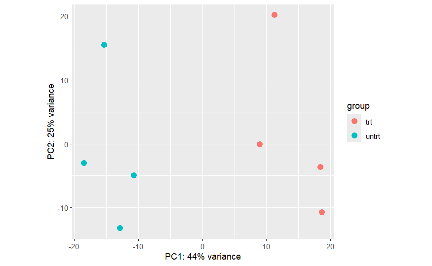

# DESeq2 PCA Analysis for RNA-seq Data (airway dataset)


This repository provides a beginner-friendly introduction to **Principal Component Analysis (PCA)** applied to RNA-seq data using the **DESeq2** package in R.

The tutorial is designed for undergraduate-level bioinformatics and biotechnology students, with a strong focus on understanding *why* each analytical step is performed rather than only *how* to execute the code.

---

## Contents

This tutorial covers the following topics:

- Conceptual explanation of PCA in RNA-seq analysis  
- Data requirements and assumptions for PCA  
- Introduction to DESeq2 and its role in RNA-seq workflows  
- Variance Stabilizing Transformation (VST)  
- PCA visualization and interpretation  
- Practical example using the **airway** RNA-seq dataset  

---

## Dataset

The analysis is based on the **airway** dataset, a well-curated RNA-seq dataset commonly used for teaching and demonstration purposes.

The dataset includes:

- Raw RNA-seq count matrix (genes × samples)  
- Sample metadata (control vs treatment groups)  
- A clear experimental design suitable for PCA visualization

---

## Workflow Overview

The analysis follows a simplified RNA-seq exploratory workflow:
```
RNA-seq count matrix + sample metadata
        ↓
Create DESeq2 dataset object
        ↓
Normalization and dispersion estimation
        ↓
Variance Stabilizing Transformation (VST)
        ↓
Principal Component Analysis (PCA)
        ↓
Visualization and biological interpretation
```

This workflow represents a typical **quality control and exploratory analysis strategy for bulk RNA-seq data**.

---
## Repository Structure

The repository is organized as follows:
```
DESeq2-PCA-RNAseq-Tutorial
│
├── docs/
│   └── index.html            # Rendered tutorial used for GitHub Pages
│
├── figures/
│   └── pca_plot.png          # PCA plot generated during the analysis
│
├── DESeq2_PCA_airway.Rmd     # Main R Markdown tutorial file
├── README.md                 # Project documentation
├── LICENSE
```

**File descriptions**

- `DESeq2_PCA_airway.Rmd`  
  The main tutorial file containing explanations, code, and analysis steps.

- `docs/index.html`  
  Rendered HTML output used for GitHub Pages so the tutorial can be viewed directly in the browser.

- `figures/pca_plot.png`  
  Example PCA plot generated from the RNA-seq dataset.

---

## Example PCA Plot

The following PCA plot shows the separation between treatment and control samples
in the **airway RNA-seq dataset** after applying the Variance Stabilizing
Transformation (VST) provided by DESeq2.



*Figure: PCA visualization of RNA-seq samples from the airway dataset.  
Samples cluster according to treatment condition (dexamethasone vs untreated),
demonstrating how PCA can reveal global differences in gene expression profiles.*

---

## Requirements

To run this tutorial you need:

- **R (version ≥ 4.2 recommended)**
- **Bioconductor**

Required R packages:
- `DESeq2`
- `airway`
- `BiocManager`

### Install Required Packages

If the required packages are not installed, you can install them in R using:

```r
install.packages("BiocManager")
BiocManager::install(c("DESeq2", "airway"))
```
These packages provide:

DESeq2 → RNA-seq differential expression analysis and transformations

airway → example RNA-seq dataset used in this tutorial
---

## How to Run

1. Clone or download this repository.

2. Open the tutorial file in **RStudio**:

`DESeq2_PCA_airway.Rmd`

3. Run the code chunks or click **Knit** to generate the HTML report.
---
## Target Audience

This repository is intended for:

- undergraduate students in **Biotechnology and Bioinformatics**  
- researchers new to **RNA-seq exploratory data analysis**  
- learners interested in **PCA interpretation in biological datasets**
---
## Educational Purpose

This tutorial was developed for educational purposes and emphasizes:

- step-by-step explanation of the analytical workflow  
- interpretation of PCA results in a biological context  
- understanding quality control in RNA-seq data analysis  

For large-scale or clinical RNA-seq studies, additional statistical modeling and quality control procedures would be required.
---
## AI Assistance Disclosure

Artificial intelligence tools were partially used to improve documentation structure, clarity, and organization. All analytical workflows, interpretations, and final validations were performed by the author.
---
## Author

**Oğuzhan Işılay**  
Undergraduate Student in Biotechnology  
Mersin University — Türkiye  

Research interests:

- Bioinformatics  
- RNA-seq analysis  
- Biological data visualization  

GitHub:  
https://github.com/oguzhanisilay8
---
## License

This project is distributed under the **MIT License**.

You are free to use, modify, and distribute this material with proper attribution.

For more details, see the `LICENSE` file included in this repository.
## Citation

If you use this tutorial in teaching materials, coursework, or other educational resources, please cite the repository as follows:

Oğuzhan Işılay (2026).  
*DESeq2 PCA Analysis for RNA-seq Data (airway dataset).*  
GitHub repository.  
https://github.com/oguzhanisilay8/DESeq2-PCA-RNAseq-Tutorial

## Tutorial Website

You can view the rendered tutorial here:

https://oguzhanisilay8.github.io/DESeq2-PCA-RNAseq-Tutorial/

