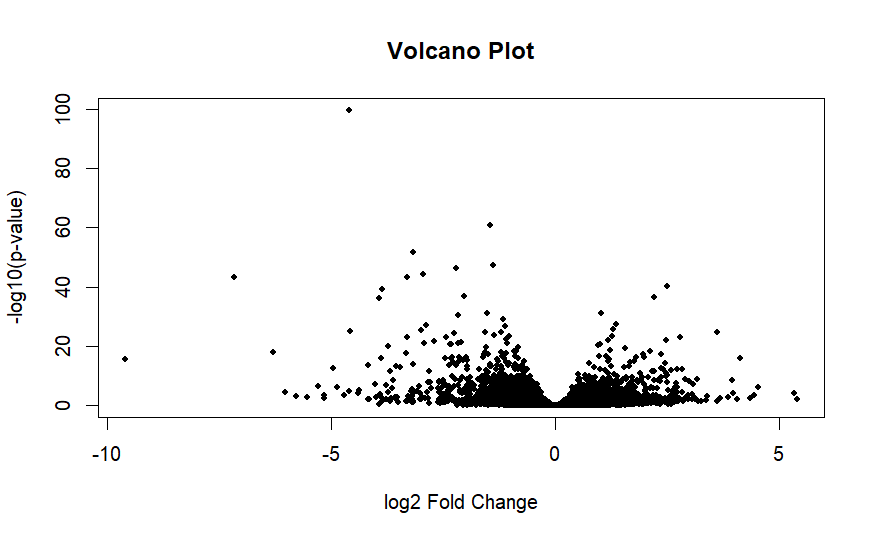
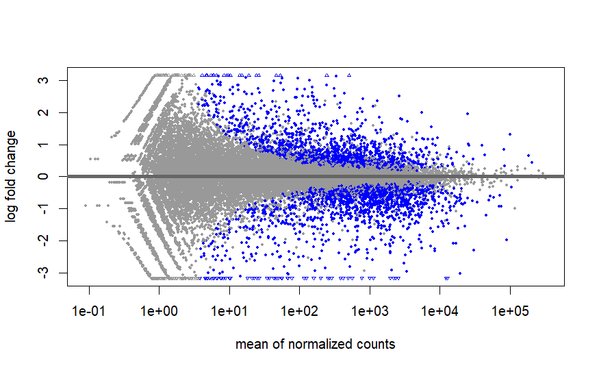
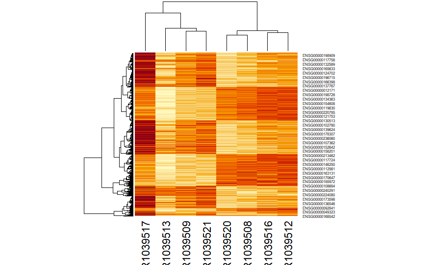

# DESeq2 PCA Analysis for RNA-seq Data (airway dataset)

This repository provides a beginner-friendly introduction to RNA-seq exploratory analysis using the DESeq2 package in R.

The tutorial focuses on understanding how RNA-seq data can be explored and interpreted using dimensionality reduction and visualization techniques such as PCA, MA plots, volcano plots and heatmaps.

The main goal is to help beginners understand the logic of RNA-seq analysis rather than only executing code.

---

# Project Overview

RNA sequencing (RNA-seq) allows researchers to measure gene expression across different biological conditions.

However, raw RNA-seq count data is difficult to interpret directly. For this reason statistical methods and visualization tools are used to explore global expression patterns and identify genes that change between conditions.

In this tutorial we focus on the following tasks:

- exploring RNA-seq datasets
- understanding sample relationships
- visualizing gene expression differences
- learning the basic workflow used in transcriptomics analysis

The analysis is performed using the DESeq2 package from the Bioconductor ecosystem.

---

# Dataset

The analysis is based on the airway dataset.

The airway dataset is widely used in RNA-seq tutorials and teaching material because it contains both gene expression counts and sample metadata.

The dataset contains:

- raw RNA-seq count matrix
- sample metadata
- control and treatment conditions
- human airway smooth muscle cell samples

This allows us to demonstrate RNA-seq exploratory analysis without requiring raw sequencing preprocessing.

---

# Workflow Overview

The analysis follows a simplified RNA-seq exploratory workflow:

RNA-seq count matrix + sample metadata  
        ↓  
Create DESeq2 dataset object  
        ↓  
Normalization and dispersion estimation  
        ↓  
Variance Stabilizing Transformation (VST)  
        ↓  
Principal Component Analysis (PCA)  
        ↓  
Differential expression analysis  
        ↓  
Visualization (MA plot, Volcano plot, Heatmap)

This type of workflow is commonly used as a first step in RNA-seq data exploration.

---

# Repository Structure

DESeq2-PCA-RNAseq-Tutorial

docs/  
    deseq2_rnaseq_analysis.html  
    index.html  

figures/  
    pca_plot.png  
    volcano_plot.png  
    ma_plot.png  
    heatmap_top_genes.png  

deseq2_pca_tutorial.Rmd  
deseq2_rnaseq_analysis.Rmd  

README.md  
LICENSE  
CITATION.cff

The docs folder contains the rendered HTML tutorial generated from the RMarkdown analysis.

The figures folder contains plots generated during the analysis.

---

# PCA Visualization

Principal Component Analysis (PCA) is commonly used in RNA-seq analysis to explore relationships between samples.

PCA reduces thousands of gene expression variables into a few components that capture the largest sources of variation.

Samples that cluster together usually share similar transcriptional profiles.

---

# Volcano Plot

The volcano plot combines fold change and statistical significance in one visualization.

- x-axis shows log2 fold change
- y-axis shows statistical significance (-log10 p-value)

Genes that appear far from the center and high on the plot are often the most biologically interesting candidates.

---

# MA Plot

The MA plot is another common visualization in RNA-seq analysis.

It shows how fold changes relate to average gene expression levels.

In this plot:

- x-axis shows mean normalized expression
- y-axis shows log fold change

This plot helps detect genes that are strongly upregulated or downregulated.

---

# Heatmap of Gene Expression

Heatmaps are widely used in transcriptomics to visualize expression patterns across samples.

Heatmaps help reveal patterns such as:

- sample clustering
- gene co-expression
- treatment effects

---

# Tools and Packages

The analysis was performed using R and packages from the Bioconductor ecosystem.

Main packages used:

DESeq2  
airway  
pheatmap  
clusterProfiler  

These tools are widely used for RNA-seq analysis and transcriptomics research.

---

# Reproducibility

The analysis is written as an RMarkdown document.

This approach allows code, explanations and figures to be integrated in a single document.

The rendered HTML tutorial can be found in the docs folder:

docs/index.html

Session information and package versions are included in the analysis using:

sessionInfo()

This helps ensure that the analysis can be reproduced in the future.

---

# Educational Purpose

This repository was created as a learning project while studying RNA-seq analysis in R.

The tutorial emphasizes:

- understanding the analysis workflow
- interpreting RNA-seq visualizations
- practicing reproducible bioinformatics analysis

For real research projects, additional quality control and statistical modeling steps would normally be required.

---

# AI Assistance Disclosure

Artificial intelligence tools were partially used to assist with documentation structure, language clarity and organization.

All analysis steps, interpretation and validation were performed by the author.

---

# Author

Oğuzhan Işılay  
Undergraduate Student in Biotechnology  
Mersin University — Türkiye

Research interests

Bioinformatics  
RNA-seq analysis  
Biological data visualization  

GitHub  
https://github.com/oguzhanisilay8

LinkedIn  
https://www.linkedin.com/in/oguzhan-isilay-

---

# License

This project is released under the MIT License.

You are free to use, modify and distribute the material with proper attribution.

See the LICENSE file for details.

---

# Citation

If you use this tutorial for teaching or educational purposes please cite:

Oğuzhan Işılay (2026)  
DESeq2 PCA Analysis for RNA-seq Data (airway dataset)  
GitHub repository  

https://github.com/oguzhanisilay8/DESeq2-PCA-RNAseq-Tutorial

---

# Tutorial Website

The rendered tutorial can be viewed here:

https://oguzhanisilay8.github.io/DESeq2-PCA-RNAseq-Tutorial/
